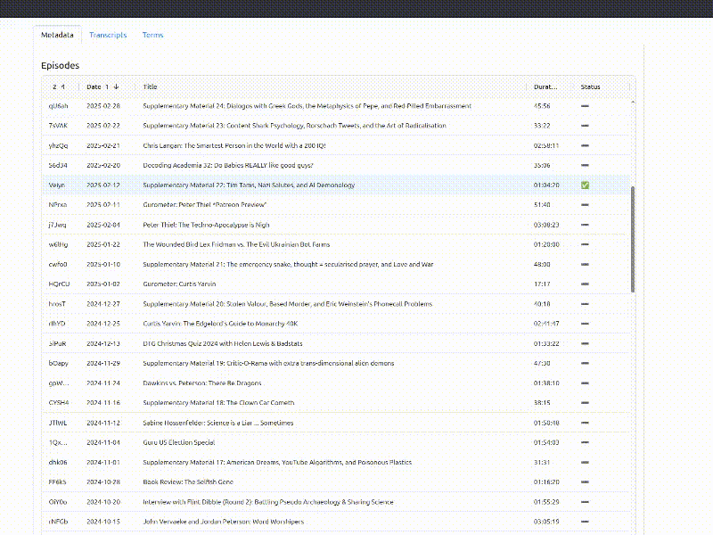

# Podology

A research tool that provides a web interface to search, analyze, and visualize podcast contents.

This project was born from the question, "In which episode did they have that nice comparison...?", followed up by "Actually, how many more times did they talk about this?",
and ultimately, "Do we see any tendencies over time?"

When faced with a back catalog of hundreds of hour-long episodes of speech, finding quotes is hard, and so is preparing time series analyses or extracting information. 



## Features

- Fast and flexible search of transcripts using [Elasticsearch](https://github.com/elastic/elasticsearch)
- Plotting interactive time series for use of terminology or appearance of names (more analysis angles to come!)
- Integrates with the dedicated [whisperX transcription API](https://github.com/andmbg/podology_transcriber_whisperx) to produce diarized transcripts for viz and analysis, and with the dedicated [blender renderer API](https://github.com/andmbg/podology_renderer_blender_ticker) to produce animated word clouds for exploring transcripts fast. Just run those on your (GPU-accelerated) machine, point Podology there and have it do the work.


## Built with

- Python
- Pandas
- FastAPI
- Elasticsearch
- Wordcloud
- nltk
- Plotly/Dash
- Bootstrap
- Blender
- Redis

## Getting Started

### Installation

```bash
git clone https://github.com/andmbg/podology.git
cd podology
make install
```

### Setup

Assuming you want to do transcription and scroll video rendering, and have the respective APIs running, rename `.env.example` to `.env` and edit:

- set an `API_TOKEN`. This is to protect your APIs from access by others than yourself. For a secure token, you can use something like

  ```bash
  openssl rand -base64 24
  ```

  ...on the command line and paste it both here and in your API `.env` files.

- set the URL and port of your transcriber API and renderer API

  ```bash
  TRANSCRIBER_URL_PORT="https://xxx.xxx.xxx.xxx:8001"
  RENDERER_URL_PORT="https://xxx.xxx.xxx.xxx:8002"
  ```

You likely don't have these APIs running yet, so let's set up the `cloud-config.yaml` that speeds up their setup.

### API Setup

Depending on whether you have the possibility of using cloud-config and how `cloud-config.yaml` scripts can be supplied to your GPU server provider, you can edit this here file, `cloud-config.example.yaml` and paste, or save and upload the adapted content where you need it.

```yaml
#cloud-config
packages:
  - git
  - docker.io

runcmd:
  - systemctl start docker
  - git clone https://github.com/andmbg/podology_transcriber_whisperx.git /opt/transcriber
  - echo -e "API_TOKEN=<YOUR_API_TOKEN>\nHF_TOKEN=<YOUR_HUGGINGFACE_DIARIZATION_TOKEN>" > /opt/transcriber/.env
  - docker build -t transcriber /opt/transcriber
  - docker run -d --name transcriber -p 8001:8001 transcriber
  - git clone https://github.com/andmbg/podology_renderer_blender_ticker.git /opt/renderer
  - echo "API_TOKEN=<YOUR_API_TOKEN>" > /opt/renderer/.env
  - docker build -t renderer /opt/renderer
  - docker run -d --name renderer -p 8002:8002 renderer

```

Note in line 3 of `runcmd`: paste your own API token there, as well as the Huggingface token acquired as described in the Transcriber documentation.

This represents a one-machine setup where both APIs live side by side. Other setups for more parallelization are possible.

### App Setup

In `config.py`,

- set the project name

  ```py
  PROJECT_NAME = "<your project name>"
  ```

- verify the `frame_step` setting in `config.py`.

  ```py
  RENDERER_CONFIG = {
      # [...]
      "frame_step": 100,
  }
  ```

- enter the URL of the RSS resource at which the podcast resides.

  ```py
  CONNECTOR_ARGS = {
      "remote_resource": "<RSS URL>"
  }
  ```

### Usage

